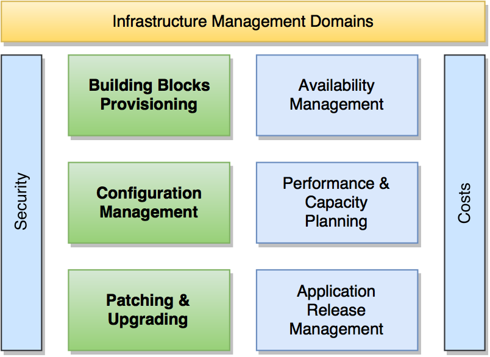

= Great Subject
João Pinto
:backend: revealjs
:revealjs_theme: sky
:revealjs_control: false
:revealjs_history: true
:encoding: utf-8
:customcss: style.css

== Goals
Make like this:

== Improvements
The following improvements will be made:

[%step]
* More *Efficiency*
* More *Elaticity*
* More *Resilience* 

== Efficiency
You will get:
[%step]
* *Processing* (VMs, SO, MDW)
* *Storage* (Virtual Disks)
* *Network* (Balancing & FW)

== Elastic
Just create new blocks with elasticity

== Build
[%step]
- Build
    * RandomX
- Config
    * config.json
- Just an item

== Questions